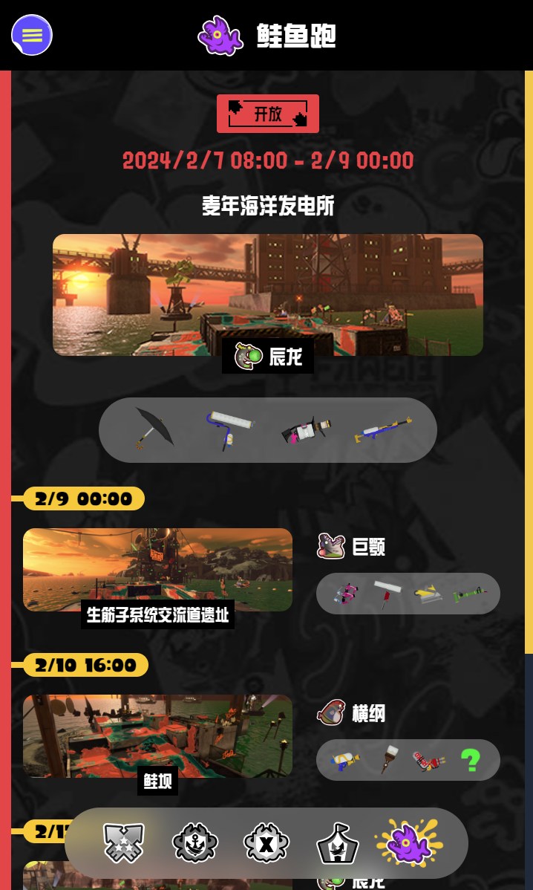

# Ink Calendar 3

Ink Calendar 3 is a chrome extension of [Splatoon3.ink](https://splatoon3.ink/).

## Acknowledgements
In this project, All data access comes from [Data-Access](https://github.com/misenhower/splatoon3.ink/wiki/Data-Access).

## Preview

  

## Setup

### Build project by yourself

```
pnpm install
pnpm run build
```

Find dist directory in project folder.

### Releases

Get the zip from [Releases](https://github.com/kayanouriko/chrome-extension-ink-calendar-3/releases)

## How to load unpacked extnsion in Chrome?
Checkout [chrome-load-unpacked-extension](https://developer.chrome.com/docs/extensions/mv3/getstarted/development-basics/#load-unpacked)

## Translations help
Any help correcting current ones is greatly appreciated!

The locale files can be found here: [/src/assets/i18n](https://github.com/kayanouriko/chrome-extension-ink-calendar-3/tree/main/src/assets/i18n)

If you have a translation to submit a pull request from a GitHub fork of project is preferred, however if you don't have a github account you may contact me to arrange another way to submit them.

